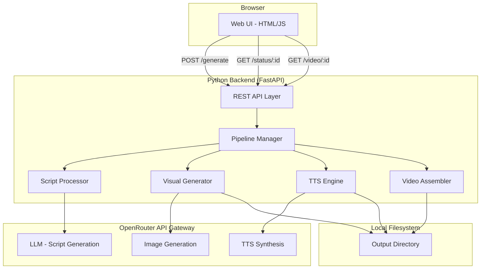
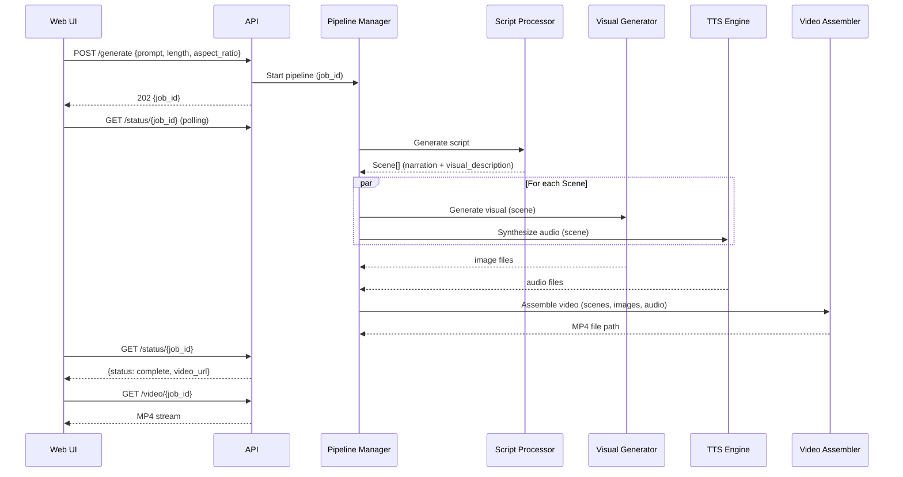

# Design Document: OpenStoryMode

## Overview

OpenStoryMode is a local-first video generation application that transforms a text prompt into a short-form animated video with AI-generated visuals and TTS narration. The system runs as a Python backend (localhost HTTP server) with a simple web frontend. The pipeline flow is: user submits prompt → LLM generates scene-by-scene script → concurrent AI image generation and TTS synthesis per scene → FFmpeg-based video assembly → MP4 output with inline playback and download.

The backend is built with FastAPI (the Python web framework for serving the REST API and static files). All external AI calls — LLM script generation, image generation, and TTS synthesis — are routed through OpenRouter (https://openrouter.ai/), a unified API gateway that provides access to multiple AI models via a single endpoint and API key. This simplifies configuration (one API key instead of many) and allows switching between underlying models without code changes. All artifacts are stored locally on disk.

## Architecture



### Pipeline Flow



## Components and Interfaces

### REST API Layer (FastAPI)

| Endpoint | Method | Request | Response |
|---|---|---|---|
| `/api/generate` | POST | `{prompt: str, video_length: str, aspect_ratio: str}` | `{job_id: str}` (202) |
| `/api/status/{job_id}` | GET | — | `{job_id, status, stage, progress_pct, error, video_url}` |
| `/api/video/{job_id}` | GET | — | MP4 file stream |
| `/` | GET | — | Static HTML/JS/CSS |

### Script Processor

Calls the OpenRouter API (LLM endpoint) with a structured prompt that includes the user's text, target video length, and aspect ratio. Returns a list of `Scene` objects.

- **Input**: `prompt: str`, `video_length: str`, `aspect_ratio: str`
- **Output**: `list[Scene]` where each Scene has `narration_text` and `visual_description`
- **Scene count heuristic**: Based on video length — roughly 1 scene per 5-10 seconds of target duration
- **LLM prompt template**: Instructs the model to produce JSON output with scene breakdowns, keeping narration within timing constraints

### Visual Generator

Calls the OpenRouter API (image generation endpoint) for each scene's visual description.

- **Input**: `visual_description: str`, `aspect_ratio: str`
- **Output**: `Path` to saved image file
- **Retry policy**: Up to 2 retries on failure (3 total attempts)
- **Resolution mapping**: 9:16 → 720×1280, 16:9 → 1280×720 (minimum)

### TTS Engine

Calls the OpenRouter API (TTS endpoint) to synthesize narration audio for each scene.

- **Input**: `narration_text: str`
- **Output**: `Path` to saved audio file (WAV or MP3)
- **Retry policy**: Up to 2 retries on failure (3 total attempts)

### Video Assembler

Uses FFmpeg (via subprocess or `ffmpeg-python`) to composite scene visuals and audio into a final MP4.

- **Input**: `list[SceneAsset]` (image path + audio path per scene), `aspect_ratio: str`
- **Output**: `Path` to final MP4 file
- **Crossfade**: 0.5s transition between consecutive scenes
- **Sync**: Each visual displays for the duration of its corresponding audio

### Pipeline Manager

Orchestrates the full generation pipeline, manages job state, and coordinates concurrency.

- **Concurrency**: Uses `asyncio.gather` (or `concurrent.futures.ThreadPoolExecutor`) to run visual generation and TTS synthesis in parallel per scene
- **Stage tracking**: Maintains current stage per job (`script_generation`, `visual_generation`, `tts_synthesis`, `video_assembly`, `complete`, `error`)
- **Abort policy**: If any scene fails both visual and TTS after retries, abort the entire pipeline

### Web UI

A single-page HTML/JS frontend (no framework needed for MVP). Served as static files by FastAPI.

- Prompt textarea with character counter (max 5000)
- Video length dropdown (10s, 30s, 60s, 90s)
- Aspect ratio dropdown (9:16, 16:9)
- Submit button with validation
- Progress display: stage name + polling every 3-5 seconds
- Video player (`<video>` element) and download button on completion
- Metadata display: duration, aspect ratio, file size

## Data Models

```python
from dataclasses import dataclass, field
from enum import Enum
from pathlib import Path
from typing import Optional
import uuid


class VideoLength(str, Enum):
    TEN = "10s"
    THIRTY = "30s"
    SIXTY = "60s"
    NINETY = "90s"

    def to_seconds(self) -> int:
        return int(self.value.replace("s", ""))


class AspectRatio(str, Enum):
    VERTICAL = "9:16"
    HORIZONTAL = "16:9"

    def resolution(self) -> tuple[int, int]:
        if self == AspectRatio.VERTICAL:
            return (720, 1280)
        return (1280, 720)


class JobStage(str, Enum):
    QUEUED = "queued"
    SCRIPT_GENERATION = "script_generation"
    VISUAL_GENERATION = "visual_generation"
    TTS_SYNTHESIS = "tts_synthesis"
    VIDEO_ASSEMBLY = "video_assembly"
    COMPLETE = "complete"
    ERROR = "error"


@dataclass
class Scene:
    index: int
    narration_text: str
    visual_description: str


@dataclass
class SceneAsset:
    scene_index: int
    image_path: Optional[Path] = None
    audio_path: Optional[Path] = None


@dataclass
class GenerationRequest:
    prompt: str
    video_length: VideoLength
    aspect_ratio: AspectRatio


@dataclass
class Job:
    job_id: str = field(default_factory=lambda: str(uuid.uuid4()))
    request: Optional[GenerationRequest] = None
    stage: JobStage = JobStage.QUEUED
    scenes: list[Scene] = field(default_factory=list)
    assets: list[SceneAsset] = field(default_factory=list)
    video_path: Optional[Path] = None
    error: Optional[str] = None
    error_stage: Optional[JobStage] = None
```

### Directory Structure for Artifacts

```
output/
  {job_id}/
    script.json          # Scene breakdown from LLM
    scenes/
      scene_0_image.png  # Visual for scene 0
      scene_0_audio.mp3  # Narration for scene 0
      scene_1_image.png
      scene_1_audio.mp3
      ...
    output.mp4           # Final assembled video
```


## Correctness Properties

*A property is a characteristic or behavior that should hold true across all valid executions of a system — essentially, a formal statement about what the system should do. Properties serve as the bridge between human-readable specifications and machine-verifiable correctness guarantees.*

### Property 1: Empty/whitespace prompt rejection

*For any* string composed entirely of whitespace (including the empty string), submitting it as a prompt should be rejected by validation, and no generation request should be created.

**Validates: Requirements 1.2**

### Property 2: Valid prompt acceptance

*For any* non-empty, non-whitespace-only string of up to 5000 characters paired with any valid VideoLength and AspectRatio, the system should accept the submission and create a generation job.

**Validates: Requirements 1.5**

### Property 3: Script structure validity

*For any* valid generation request, the Script Processor output must be a non-empty list of Scenes where each Scene has non-empty `narration_text` and non-empty `visual_description`.

**Validates: Requirements 2.1**

### Property 4: Scene count scales with video length

*For any* valid generation request, the number of Scenes produced by the Script Processor should increase (non-strictly) as the selected VideoLength increases, and should be at least 1 for any video length.

**Validates: Requirements 2.2**

### Property 5: Narration duration within tolerance

*For any* generated script, the total estimated spoken duration of all Scene narration texts (using a words-per-minute heuristic) should be within ±20% of the selected VideoLength in seconds.

**Validates: Requirements 2.4**

### Property 6: One asset per scene

*For any* list of Scenes passed through the pipeline, the Visual Generator should produce exactly one image file per Scene, and the TTS Engine should produce exactly one audio file per Scene, resulting in a 1:1:1 mapping of scenes to images to audio files.

**Validates: Requirements 3.1, 4.1**

### Property 7: Aspect ratio determines resolution

*For any* AspectRatio value, the resolution parameters passed to the image generation API should match the defined resolution mapping (9:16 → 720×1280, 16:9 → 1280×720) and meet the minimum 720p equivalent.

**Validates: Requirements 3.2**

### Property 8: API retry on failure

*For any* API call (image generation or TTS) that fails, the system should retry up to 2 additional times (3 total attempts) before reporting an error. The error report must include the Scene identifier and error details.

**Validates: Requirements 3.3, 3.4, 4.3, 4.4**

### Property 9: TTS audio format compatibility

*For any* TTS Engine output, the produced audio file must be in WAV or MP3 format (verifiable by file extension and/or magic bytes).

**Validates: Requirements 4.2**

### Property 10: Video assembly produces valid MP4

*For any* complete set of SceneAssets (each having both an image path and audio path), the Video Assembler should produce a single output file in MP4 format.

**Validates: Requirements 5.1**

### Property 11: Output video matches selected aspect ratio

*For any* assembled video, the output video dimensions should match the user-selected AspectRatio (9:16 or 16:9).

**Validates: Requirements 5.2**

### Property 12: Visual-audio synchronization

*For any* Scene in the assembled video, the visual display duration should equal the corresponding narration audio duration (within a tolerance of ±0.1 seconds).

**Validates: Requirements 5.3**

### Property 13: Video metadata completeness

*For any* completed video, the metadata extraction function should return duration (in seconds), aspect ratio, and file size (in bytes), all with non-null positive values.

**Validates: Requirements 6.3**

### Property 14: Job status reflects stage and errors

*For any* Job, the status response must include a valid `stage` from the defined JobStage enum. If the job is in the ERROR stage, the response must also include a non-empty `error` message and the `error_stage` indicating where the failure occurred.

**Validates: Requirements 7.1, 7.3**

### Property 15: Pipeline stage ordering

*For any* successful job, the sequence of stage transitions must follow the order: QUEUED → SCRIPT_GENERATION → VISUAL_GENERATION/TTS_SYNTHESIS → VIDEO_ASSEMBLY → COMPLETE. No stage may be skipped or reordered.

**Validates: Requirements 8.2**

### Property 16: Pipeline abort on scene failure

*For any* pipeline execution where a Scene fails both visual generation and TTS synthesis after all retries, the pipeline must transition to the ERROR stage and not proceed to video assembly.

**Validates: Requirements 8.3**

### Property 17: Artifact storage completeness

*For any* completed job, the output directory must contain: the script JSON file, one image file per scene, one audio file per scene, and the final MP4 video file.

**Validates: Requirements 8.4**

### Property 18: Configuration reading and validation

*For any* configuration where the OpenRouter API key and port are written to environment variables or a config file, the Backend should read back the same values. If the required OpenRouter API key is missing, the Backend should report it at startup.

**Validates: Requirements 9.3, 9.4**

## Error Handling

### OpenRouter API Failures (Image Generation, TTS, LLM)

- All external API calls go through OpenRouter and use a unified retry wrapper: up to 2 retries with exponential backoff (1s, 2s delays).
- On final failure, the error is captured with the scene identifier and propagated to the Pipeline Manager.
- The Pipeline Manager decides whether to abort (if both visual and TTS fail for a scene) or continue (if only one fails — though for MVP, both are required).

### LLM Output Parsing

- The Script Processor validates LLM JSON output against the expected schema (list of scenes with narration_text and visual_description).
- Malformed LLM output is treated as a failure and triggers the error path (no retry on parse failure — the prompt is deterministic enough that retrying won't help).

### Video Assembly Failures

- FFmpeg errors are captured from stderr and included in the error report.
- Common failure modes: missing input files, codec issues, disk space. The error message should indicate the specific failure.

### Frontend Error Display

- All errors surface to the Web UI via the `/api/status/{job_id}` endpoint.
- The UI displays the error message and the stage where the failure occurred.
- The user can retry by submitting a new generation request.

### Configuration Errors

- On startup, the Backend validates that the OpenRouter API key is present.
- Missing key is reported with a specific name (e.g., "Missing API key: OPENROUTER_API_KEY").
- The server refuses to start if the required key is missing.

## Testing Strategy

### Unit Tests

Unit tests cover specific examples, edge cases, and integration points:

- **Prompt validation**: Empty string, whitespace-only, exactly 5000 chars, over 5000 chars
- **VideoLength/AspectRatio enums**: `to_seconds()` and `resolution()` return correct values
- **Script Processor output parsing**: Valid JSON, malformed JSON, missing fields
- **Retry logic**: 0 failures, 1 failure then success, 2 failures then success, 3 failures (all retries exhausted)
- **Video metadata extraction**: Known MP4 file returns correct duration, dimensions, size
- **Configuration validation**: All keys present, one missing, all missing
- **Pipeline stage transitions**: Happy path, error at each stage
- **FFmpeg command construction**: Correct crossfade parameters, aspect ratio, input/output paths

### Property-Based Tests

Property-based tests validate universal properties across generated inputs. Use `hypothesis` (Python) as the PBT library.

Each property test must:
- Run a minimum of 100 iterations
- Reference its design document property with a tag comment
- Use `hypothesis.given()` with appropriate strategies

Property test mapping:

| Property | Test Description | Generator Strategy |
|---|---|---|
| 1: Empty/whitespace rejection | Generate whitespace-only strings, verify rejection | `st.text(alphabet=st.sampled_from(' \t\n\r'), min_size=0, max_size=100)` |
| 2: Valid prompt acceptance | Generate non-empty printable strings, verify acceptance | `st.text(min_size=1, max_size=5000).filter(lambda s: s.strip())` |
| 3: Script structure validity | Generate valid requests, verify output structure | Custom strategy for GenerationRequest |
| 4: Scene count scales with length | Generate pairs of video lengths, verify ordering | `st.sampled_from(VideoLength)` pairs |
| 5: Narration duration tolerance | Generate scripts, estimate duration, check ±20% | Custom strategy for Scene lists |
| 6: One asset per scene | Generate scene lists, verify 1:1:1 mapping | `st.lists(st.builds(Scene))` |
| 7: Aspect ratio resolution | Generate aspect ratios, verify resolution mapping | `st.sampled_from(AspectRatio)` |
| 8: API retry on failure | Generate failure sequences, verify retry count | `st.lists(st.booleans(), min_size=1, max_size=3)` |
| 9: TTS audio format | Generate TTS outputs, verify format | Mock TTS with random text inputs |
| 10: Video assembly MP4 | Generate complete scene assets, verify MP4 output | Custom SceneAsset strategy |
| 11: Output aspect ratio | Generate videos with each ratio, verify dimensions | `st.sampled_from(AspectRatio)` |
| 12: Visual-audio sync | Generate scene timings, verify sync within tolerance | `st.floats(min_value=1.0, max_value=30.0)` |
| 13: Metadata completeness | Generate completed videos, verify all fields present | Custom Job strategy |
| 14: Job status stage/errors | Generate Job states, verify status response | Custom Job strategy with all stages |
| 15: Pipeline stage ordering | Generate stage transition logs, verify order | Custom strategy for stage sequences |
| 16: Pipeline abort on failure | Generate failure scenarios, verify abort | Custom failure scenario strategy |
| 17: Artifact storage | Generate completed jobs, verify file existence | Custom Job strategy |
| 18: Config reading/validation | Generate config key sets, verify read-back and missing key reports | `st.fixed_dictionaries({"OPENROUTER_API_KEY": st.text(), "PORT": st.integers(1024, 65535)})` |

Each test file should be tagged with:
```python
# Feature: story-mode-mvp, Property {N}: {property_title}
```

### Test Organization

```
tests/
  test_validation.py       # Properties 1, 2
  test_script_processor.py # Properties 3, 4, 5
  test_generators.py       # Properties 6, 7, 8, 9
  test_video_assembler.py  # Properties 10, 11, 12
  test_metadata.py         # Property 13
  test_pipeline.py         # Properties 14, 15, 16, 17
  test_config.py           # Property 18
```
